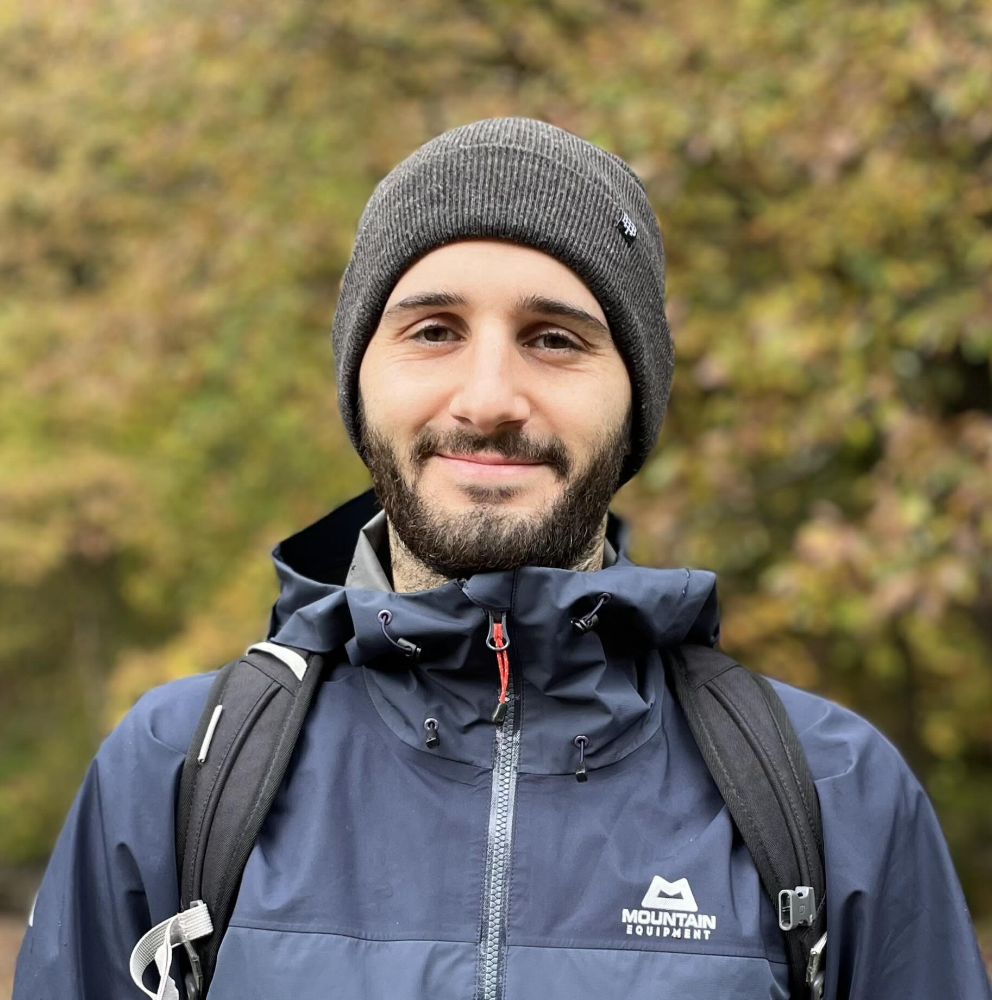

  <picture>
    <source srcset="index/me.avif" type="image/avif">
    <source srcset="index/me.webp" type="image/webp">
    
  </picture>

Hiya! I'm a software engineer based in Cardiff, Wales. I work on 4G and 5G physical layer software
with a focus on portability and performance at [Parallel Wireless](https://www.parallelwireless.com)
in Bristol. You can find my work on [GitHub](https://github.com/fng97) and you can reach me at
<a href="mailto:hello&#64;francisco&#46;wiki">hello&#64;francisco&#46;wiki</a>. I love coffee,
surfing, and hiking.

# Posts

<!-- BLOG-POSTS -->
